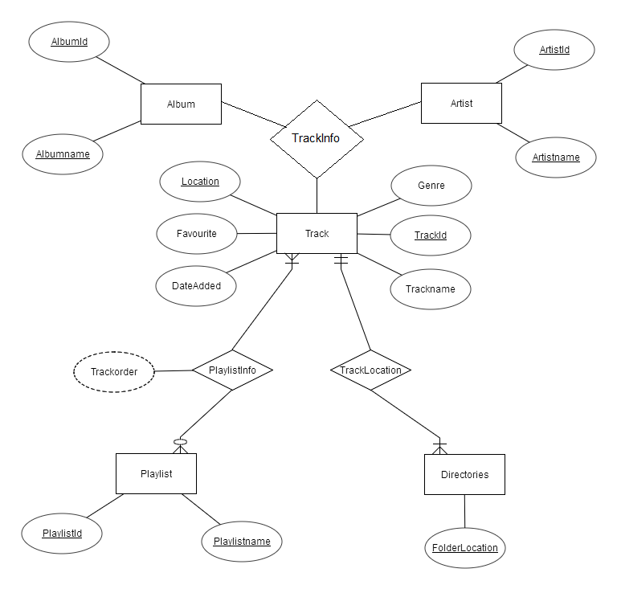

    

    <strong>Indian Institute of Technology Indore</strong>

    <strong>Computer Science &amp; Engineering</strong>

    <strong>CS 257: Lab Assignment on Case Study</strong>

    <strong>Music Player &amp; Music Management System</strong>

    <u>Submitted By:</u>

    Kunal Gupta 150001015

    Punit Lakshwani 150001025

    Shivam Tayal 150001034

    <strong>STEP-WISE ANALYSIS OF CASE STUDY </strong>

<h1>
    <em>1. Identification of Entity Sets:</em>
</h1>
<ul>
    <li>
        

            Track – Songs that will played in the Music Player.
        

    </li>
    <li>
        

            Artist – Artists of the songs in the track entity.
        

    </li>
    <li>
        

            Album – Album of the songs in track entity.
        

    </li>
    <li>
        

            Playlist – Playlists created by user.
        

    </li>
    <li>
        

            Directories – Location of folder where tracks are located.
        

    </li>
</ul>

    <h1>
    <em>2. Modeling Attributes and Keys:</em>
    </h1>

<ol>
    <li>
        

            <strong>Track:</strong>
        

    </li>
</ol>
<ul>
    <li>
        

            TrackId
        

    </li>
    <li>
        

            Trackname
        

    </li>
    <li>
        

            Location
        

    </li>
    <li>
        

            Genre
        

    </li>
    <li>
        

            DateAdded
        

    </li>
    <li>
        

            Favourite
        

    </li>
</ul>

    <strong>Primary key:</strong>
    (TrackId)

    Tracks are the songs and music files in the system. Each track will be given unique TrackID.

<ul>
    <li>
        

            TrackId : Track ID of the track.
        

    </li>
    <li>
        

            Trackname : Track name of the track.
        

    </li>
    <li>
        

            Location : Location of track in the system.
        

    </li>
    <li>
        

            Genre : Genre of the track (like pop, dance, jazz, etc.).
        

    </li>
    <li>
        

            DateAdded : The date on which the track was added to the database.
        

    </li>
    <li>
        

            Favourite : Boolean flag which is true if song is added to favourites else false.
        

    </li>
</ul>
<ol start="2">
    <li>
        

            <strong>Artist:</strong>
        

    </li>
</ol>
<ul>
    <li>
        

            ArtistId
        

    </li>
    <li>
        

            Artistname
        

    </li>
</ul>

    <strong>Primary key:</strong>
    (ArtistId)

    Artist entity contains the different artist ids and artist names.

<ul>
    <li>
        

            ArtistId : Unique Id given to the artist.
        

    </li>
    <li>
        

            Artistname : Name of the Artist.
        

    </li>
</ul>
<ol start="3">
    <li>
        

            <strong>Album:</strong>
        

    </li>
</ol>
<ul>
    <li>
        

            AlbumId
        

    </li>
    <li>
        

            Albumname
        

    </li>
</ul>

    <strong>Primary key:</strong>
    (AlbumId)

    Album entity contains the different album names and their unique ids.

<ul>
    <li>
        

            AlbumId : Unique id given to a album.
        

    </li>
    <li>
        

            Albumname : Name of the Album.
        

    </li>
</ul>
<ol start="4">
    <li>
        

            <strong>Playlist:</strong>
        

    </li>
</ol>
<ul>
    <li>
        

            PlaylistId
        

    </li>
    <li>
        

            Playlistname
        

    </li>
</ul>

    <strong>Primary key:</strong>
    (PlaylistId)

    Playlist entity contains the all the playlists created by users.

<ul>
    <li>
        

            PlaylistId : Unique id given to each playlist.
        

    </li>
    <li>
        

            Playlistname : Name of the playlist given by user.
        

    </li>
</ul>
<ol start="5">
    <li>
        

            <strong>Directories:</strong>
        

    </li>
</ol>
<ul>
    <li>
        

            FolderLocation
        

    </li>
</ul>

    <strong>Primary key: </strong>
    (FolderLocation)

    Directories contains the address of the the select directories.

<ul>
    <li>
        

            FolderLocation : Location of the directory.
        

    </li>
</ul>

    <h1>
    <em>3. Identification of Relationships:</em>
        </h1>

    Track, Artist and Album are related to each other. <strong>TrackInfo </strong>contains the artist and album of each track.

    PlayList and Track are related to each other. <strong>PlayListInfo </strong>contains the track and playlist ids along with the order of track in playlist.

    Directories contains tracks. TrackLocation relates track to its directory.

    <table width="531" cellpadding="7" cellspacing="0">
        <colgroup>
            <col width="58"/>
            <col width="147"/>
            <col width="282"/>
        </colgroup>
        <tbody>
            <tr valign="top">
                <td width="58" height="26">
                    

                        <strong>S.No.</strong>
                    

                </td>
                <td width="147">
                    

                        <strong>Relationship</strong>
                    

                </td>
                <td width="282">
                    

                        <strong>Entity Sets</strong>
                    

                </td>
            </tr>
            <tr valign="top">
                <td width="58" height="27">
                    

                        <strong>1</strong>
                    

                </td>
                <td width="147">
                    

                        TrackInfo
                    

                </td>
                <td width="282">
                    

                        Track, Artist, Album
                    

                </td>
            </tr>
            <tr valign="top">
                <td width="58" height="29">
                    

                        <strong>4</strong>
                    

                </td>
                <td width="147">
                    

                        PlaylistInfo
                    

                </td>
                <td width="282">
                    

                        Playlist, Track
                    

                </td>
            </tr>
            <tr valign="top">
                <td width="58" height="28">
                    

                        <strong>5</strong>
                    

                </td>
                <td width="147">
                    

                        TrackLocation
                    

                </td>
                <td width="282">
                    

                        Directories,Track
                    

                </td>
            </tr>
        </tbody>
    </table>

<h5>
    <em><strong>5. Description Of Relations:</strong></em>
</h5>
<ol type="A">
    <li>
        

            <strong>TrackInfo </strong>
            : (Track, Artist, Album)
        

    </li>
</ol>

    <strong>Type </strong>
    : Ternary Relationship

    Mapping cardinality

    Track  Artist : (m : 1)

    Track  Album : (m : 1)

    Artist  Album : (1 : m)

    Track : Total participation

    Artist : Total participation

    Album : Total participation

<ol type="A" start="2">
    <li>
        

            <strong>PlaylistInfo</strong>
            : (PlayList, Track)
        

    </li>
</ol>

    <strong>Type </strong>
    : Binary Relationship

    Mapping cardinality : (m : n)

    Playlist : Total participation

    Track : Partial participation

<ol type="A" start="3">
    <li>
        

            <strong>TrackLocation</strong>
            : (Directories, Track)
        

    </li>
</ol>

    <strong>Type </strong>
    : Binary Relationship

    Mapping cardinality : (1 : m)

    Directories : Partial participation

    Track : Total participation

<h5>
    <em><strong>6.Transforming Entities and Relations into Tables:</strong></em>
</h5>
<ul>
    <li>
        

            <strong>Entity sets into tables :</strong>
        

    </li>
</ul>
<ol>
    <li>
        

            Track :
        

    </li>
</ol>
<ul>
    <li>
        

            TrackId int PRIMARY KEY NOT NULL,
        

    </li>
    <li>
        

            Trackname varchar(50) NOT NULL,
        

    </li>
    <li>
        

            Location varchar(500) NOT NULL UNIQUE,
        

    </li>
    <li>
        

            DateAdded timestamp CURRENTTIMESTAMP,
        

    </li>
    <li>
        

            Genre varchar(30) NOT NULL,
        

    </li>
    <li>
        

            Favourite boolean DEFAULT (0)
        

    </li>
</ul>
<ol start="2">
    <li>
        

            Artist :
        

    </li>
</ol>
<ul>
    <li>
        

            ArtistId int PRIMARY KEY NOT NULL,
        

    </li>
    <li>
        

            Artistname varchar(50) NOT NULL UNIQUE
        

    </li>
</ul>
<ol start="3">
    <li>
        

            Album :
        

    </li>
</ol>
<ul>
    <li>
        

            AlbumId int PRIMARY KEY NOT NULL,
        

    </li>
    <li>
        

            Albumname varchar(50) NOT NULL UNIQUE
        

    </li>
</ul>
<ol start="4">
    <li>
        

            Playlist :
        

    </li>
</ol>
<ul>
    <li>
        

            PlaylistId int PRIMARY KEY NOT NULL,
        

    </li>
    <li>
        

            Playlistname varchar(100) NOT NULL UNIQUE
        

    </li>
</ul>
<ol start="5">
    <li>
        

            Directories :
        

    </li>
</ol>
<ul>
    <li>
        

            FolderLocation varchar(500) NOT NULL UNIQUE
        

    </li>
</ul>
<ul>
    <li>
        

            <strong>Relationships into tables :</strong>
        

    </li>
</ul>
<ol>
    <li>
        

            TrackInfo :
        

    </li>
</ol>
<ul>
    <li>
        

            Primary Key (TrackId)
        

    </li>
    <li>
        

            Foriegn Key (ArtistId, AlbumId)
        

    </li>
</ul>
<ol start="2">
    <li>
        

            PlayListInfo:
        

    </li>
</ol>
<ul>
    <li>
        

            Primary Key (PlayListId, TrackId)
        

    </li>
    <li>
        

            Trackorder int NOT NULL
        

    </li>
</ul>
<ol start="3">
    <li>
        

            TrackLocation:
        

    </li>
</ol>
<ul>
    <li>
        

            Primary Key (Track.Location)
        

    </li>
    <li>
        

            Foriegn Key (FolderLocation)
        

    </li>
</ul>
<h5>
     
</h5>
<h5>
    <em><strong>5. Functions:</strong></em>
</h5>

    1) Search for a artist

    CREATE FUNCTION searchartist (name varchar(50)) RETURNS int(11)

    BEGIN

    declare id int;

    set id = (select artistid from artist where artistname = name);

    if (id &gt; 0) then

    return id;

    end if;

    RETURN -1;

    END

    2) Search for a album

    CREATE FUNCTION searchalbum (name varchar(50)) RETURNS int(11)

    BEGIN

    declare id int;

    set id = (select albumid from artist where albumname = name);

    if (id &gt; 0) then

    return id;

    end if;

    RETURN -1;

    END

<h5>
     
</h5>
<h5>
    <em><strong>6. Procedures:</strong></em>
</h5>
<ol>
    <li>
        

            Adding a Directory
        

    </li>
</ol>

    CREATE PROCEDURE adddirectory (in location varchar(500))

    BEGIN

    insert into directories values (location);

    END

<ol start="2">
    <li>
        

            Adding a Track
        

    </li>
</ol>

    CREATE PROCEDURE addtrack(in trackname varchar(50),in artistname varchar(50),in albumname varchar(100),in location varchar(500),in genre varchar(30))

    Begin

    declare artistid int;

    declare albumid int;

    declare trackid int;

    set trackid = (select newid from id);

    set artistid = searchartist(artistname);

    set albumid = searchalbum(albumname);

    insert into track(trackid,trackname,location,genre) values(trackid, trackname, location, genre);

    if (artistid = -1) then

    set artistid = (select newid from id);

    insert into artist values (artistid, artistname);

    end if;

    if (albumid = -1) then

    set albumid = (select newid from id);

    insert into album values (albumid, albumname);

    end if;

    insert into trackinfo values (trackid, artistid, albumid);

    end

    3) Adding a Track to a Playlist

    CREATE PROCEDURE addtracktoplaylist (in pid int,in tid int)

    BEGIN

    declare torder int;

    set torder = (select count(*) from playlistinfo where playlistid=pid);

    set torder = torder + 1;

    insert into playlistinfo values(pid,tid,torder);

    END

    4) Creating a PlayList

    CREATE PROCEDURE createplaylist (in PlaylistName varchar(100))

    BEGIN

    declare pid int;

    set pid = (select playlistid from id);

    insert into playlist values(pid,PlaylistName);

    END

    5) Deleting a Directory

    CREATE PROCEDURE deletedirectory (in location varchar(500))

    BEGIN

    declare tid int;

    declare trackids cursor for select trackid from track where track.location like concat(location, '%'); delete from directories where folderlocation =
    location;

    open trackids;

    get_trackid : LOOP

    fetch trackids into tid;

    call deletetrack(tid);

    end loop get_trackid;

    close trackids;

    END

    6) Deleting a track from a playlist

    CREATE PROCEDURE deletefromplaylist (in pid int,in tid int)

    BEGIN

    declare torder int;

    set torder=(select trackorder from playlistinfo where playlistid=pid and trackid=tid);

    delete from playlistinfo where playlistid=pid and trackid=tid;

    update playlistinfo set trackorder=trackorder-1 where playlistid=pid and trackorder&gt;torder;

    END

    7) Deleting a playlist

    CREATE PROCEDURE deleteplaylist (in pid int)

    BEGIN

    delete from playlist where playlistid=pid;

    delete from playlistinfo where playlistid=pid;

    END

    8) Deleting a track

    CREATE PROCEDURE deletetrack (in TrackId int)

    BEGIN

    delete from track where track.trackid=TrackId;

    delete from trackinfo where trackinfo.trackid=TrackId;

    delete from playlistinfo where playlistinfo.trackid=TrackId;

    END

    9) Adding a track to Favourites

    CREATE PROCEDURE favourite (in TrackId int)

    BEGIN

    update track set favourite=True where track.trackid=TrackId;

    END

    10) Moving a track in playlist (up or down)

    CREATE PROCEDURE movetrack (in pid int, in tid int, in direction int)

    BEGIN

    declare swaptid int;

    declare torder int;

    set torder = (select trackorder from playlistinfo where playlistid = pid and trackid = tid);

    if(direction = 0) then

    set swaptid = (select trackid from playlistinfo where playlistid = pid and trackorder = torder - 1);

    update playlistinfo set trackorder = torder where playlistid = pid and trackid = swaptid;

    update playlistinfo set trackorder = torder - 1 where playlistid = pid and trackid = tid;

    else

    set swaptid = (select trackid from playlistinfo where playlistid = pid and trackorder = torder + 1);

    update playlistinfo set trackorder = torder where playlistid = pid and trackid = swaptid;

    update playlistinfo set trackorder = torder + 1 where playlistid = pid and trackid = tid;

    end if;

    END

    11) Removing a track from Favourites

    CREATE PROCEDURE unfavourite (in TrackId int)

    BEGIN

    update track set favourite=false where track.trackid=TrackId;

    END

    12) Update a playlist name

    CREATE PROCEDURE updateplaylist (in pid int, in newname varchar(50))

    BEGIN

    update playlist set playlistname = newname where playlistid = pid;

    END

    13) Updating a track information

    CREATE PROCEDURE updatetrack (in TrackId int,in newtrack varchar(50),in newartist varchar(50),in newalbum varchar(100),in newgenre varchar(30))

    BEGIN

    declare ArtistId int;

    declare AlbumId int;

    update track set trackname = newtrack, genre = newgenre where track.trackid = TrackId;

    set ArtistId=searchartist(newartist);

    set AlbumId=searchalbum(newalbum);

    if (ArtistId = -1) then

    set ArtistId=(select newid from id);

    insert into artist values (ArtistId,newartist);

    end if;

    if (AlbumId = -1) then

    set AlbumId = (select newid from id);

    insert into album values (AlbumId,newalbum);

    end if;

    update trackinfo set artistid=ArtistId, albumid=AlbumId where trackinfo.trackid = TrackId;

    END

<h5>
     
</h5>
<h5>
     
</h5>
<h5>
     
</h5>
<h5>
     
</h5>
<h5>
     
</h5>
<h5>
    <em><strong>7. Triggers:</strong></em>
</h5>

    1) Refresh artist and album after delete in trackinfo

    CREATE TRIGGER deleterefresh AFTER DELETE ON trackinfo

    FOR EACH ROW

    BEGIN

    DELETE FROM album WHERE albumid NOT IN (SELECT DISTINCT albumid FROM trackinfo);

    DELETE FROM artist WHERE artistid NOT IN (SELECT DISTINCT artistid FROM trackinfo);

    END

    2) Refresh artist and album after update in trackinfo

    CREATE TRIGGER deleterefresh AFTER UPDATE ON trackinfo

    FOR EACH ROW

    BEGIN

    DELETE FROM album WHERE albumid NOT IN (SELECT DISTINCT albumid FROM trackinfo);

    DELETE FROM artist WHERE artistid NOT IN (SELECT DISTINCT artistid FROM trackinfo);

    END

<h5>
     
</h5>
<h5>
    <em><strong>8. </strong></em>
    <em><strong>ER-DIAGRAM OF MUSIC MANAGEMENT SYSTEM</strong></em>
</h5>

    
    

